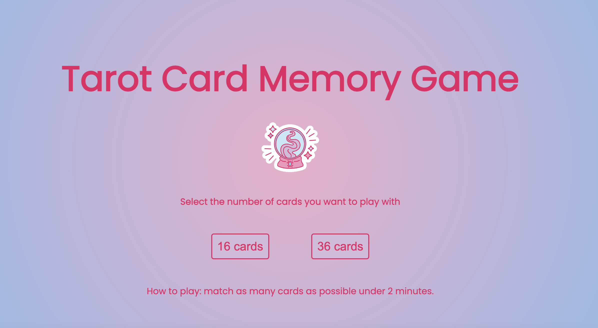

# Tarot Card Memory Game
This is a tarot card theme memory game.
Click <a href="https://hovivian.github.io/project-1/">here</a> to start playing

## How to play:
- select the number of cards you want you play
- match as many cards as possible under 2 minutes
- you will get 10 points for each pair of cards you match
- get extra points if you finish the game before the time runs out

## Credits
Tarot card icons: <a href="https://www.flaticon.com/">Flat Icon</a>
Key visual: <a href="https://giphy.com/">Giphy</a>
Sound effects: <a href="https://www.youtube.com/watch?v=vS-8Dtr_R50&ab_channel=bluemoonx">bluemoonx</a>
